# Configuring Authentication for a Zed Lake Service

A [Zed lake service](../commands/zed.md#serve) may be configured to require
user authentication to be accessed from clients such as the
[Zui](https://zui.brimdata.io/) application, the
[`zed`](../commands/zed.md) CLI tools, or the
[Zed Python client](../libraries/python.md). This document describes a simple
[Auth0](https://auth0.com) configuration with accompanying `zed serve` flags
that can be used as a starting point for creating similar configurations in
your own environment.

## Environment

Our example environment consists of the following:

1. An Auth0 trial account containing a verified user `testuser@brimdata.io`
2. A Linux VM with IP address `192.168.5.75` on which we'll run our Zed lake service
3. A macOS desktop on which we'll run our Zui app and `zed` CLI tooling

## Auth0 API Configuration

1. Begin creating a new API by clicking **APIs** in the left navigation menu
and then clicking the **Create API** button.

   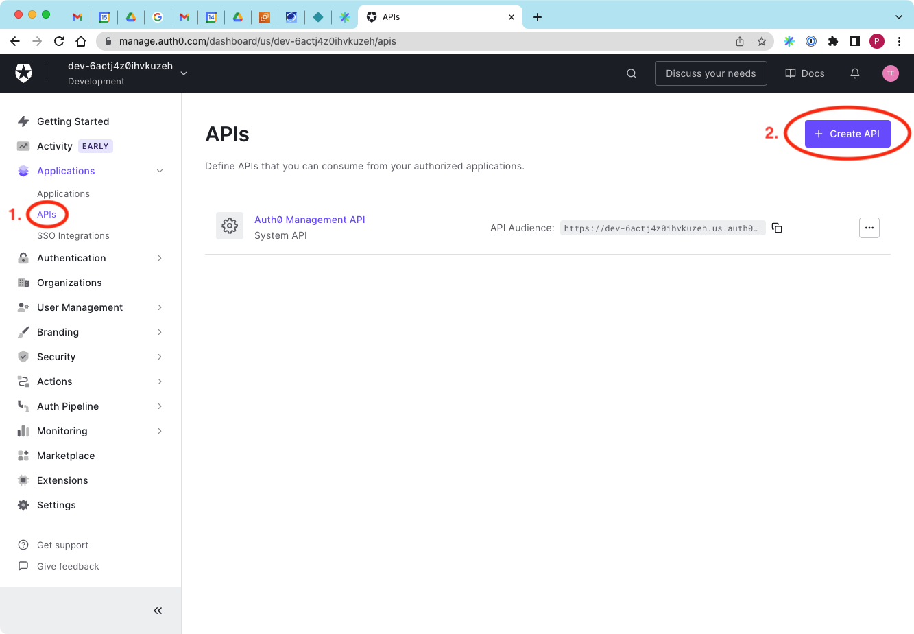

2. Enter any **Name** and URL **Identifier** for the API, then click the
**Create** button.
:::tip
Note the value you enter for the **Identifier** as you'll
need it later for the Zed lake service configuration.
:::

   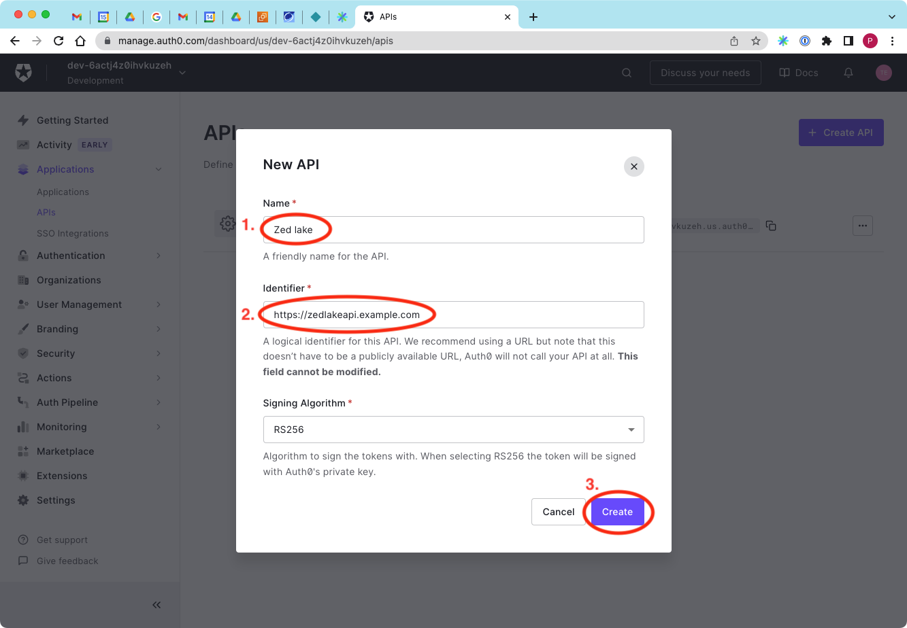

3. Click the **Settings** tab for your newly created API.

   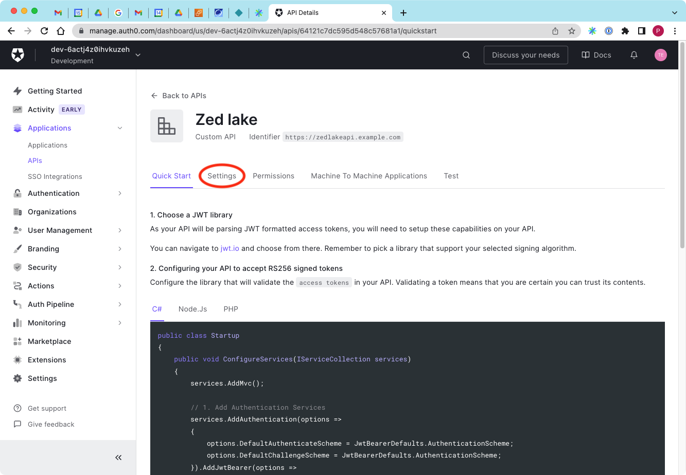

4. Scroll down in the **Settings** tab and click the toggle to enable
**Allow Offline Access**, then click the **Save** button.

   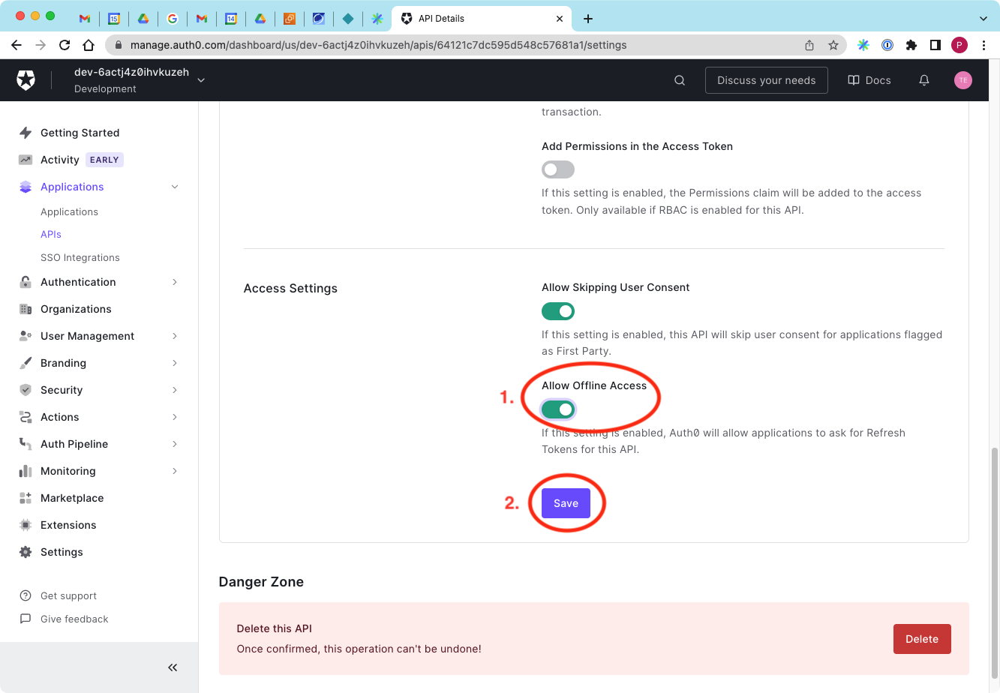

## Auth0 Application Configuration

1. Begin creating a new application by clicking **Applications** in the left
navigation menu and then clicking the **Create Application** button.
:::tip Note
Neither the "Zed lake (Test Application)" that was created for us
automatically when we created our API nor the Default App that came with the
trial are used in this configuration.
:::

   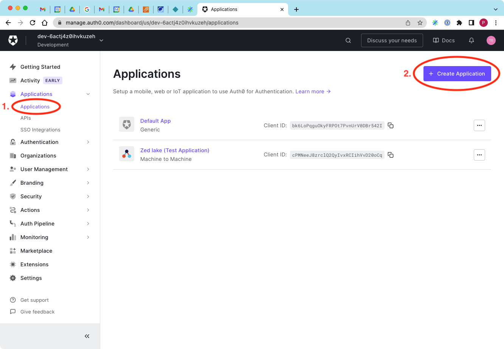

2. Enter any **Name** for the application. Keeping the default selection for
creating a **Native** app, click the **Create** button.

   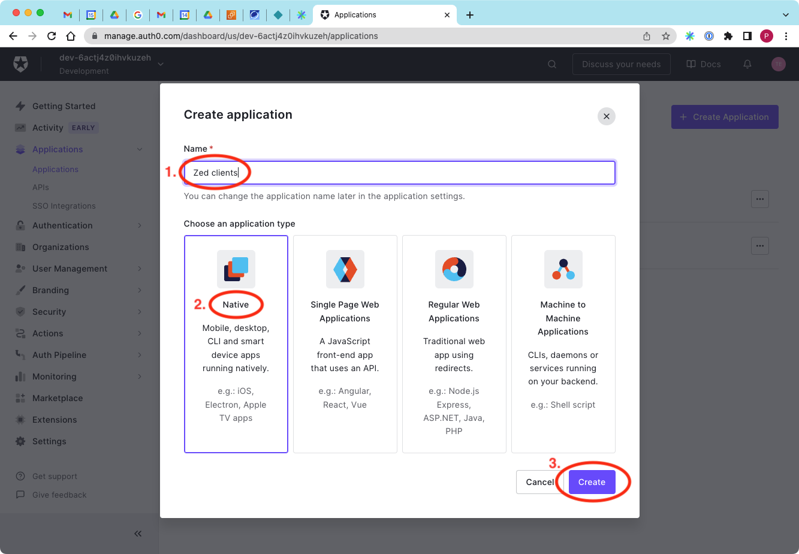

3. Click the **Settings** tab for your newly created application.

   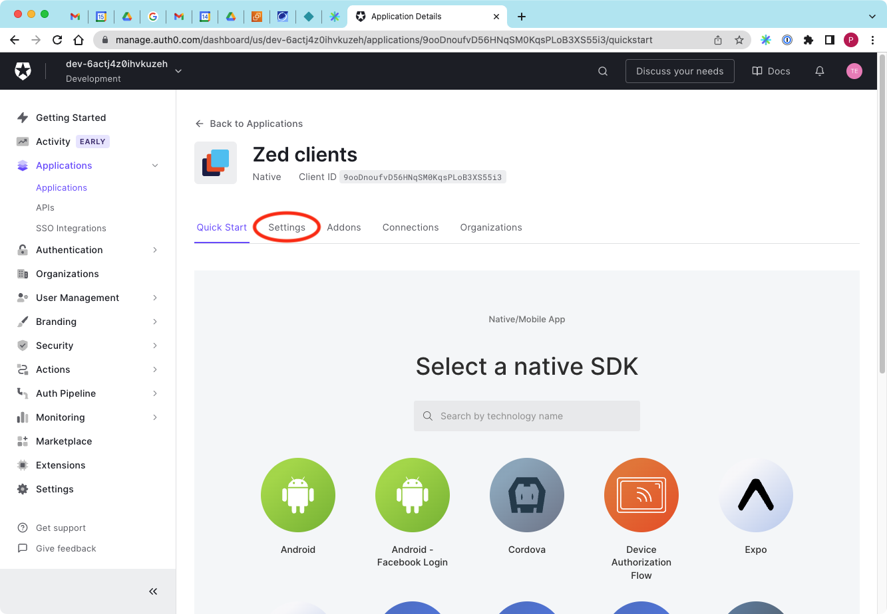

4. On the **Settings** tab, note the **Domain** and **Client ID** values, as
you'll need them later for the Zed lake service configuration.

   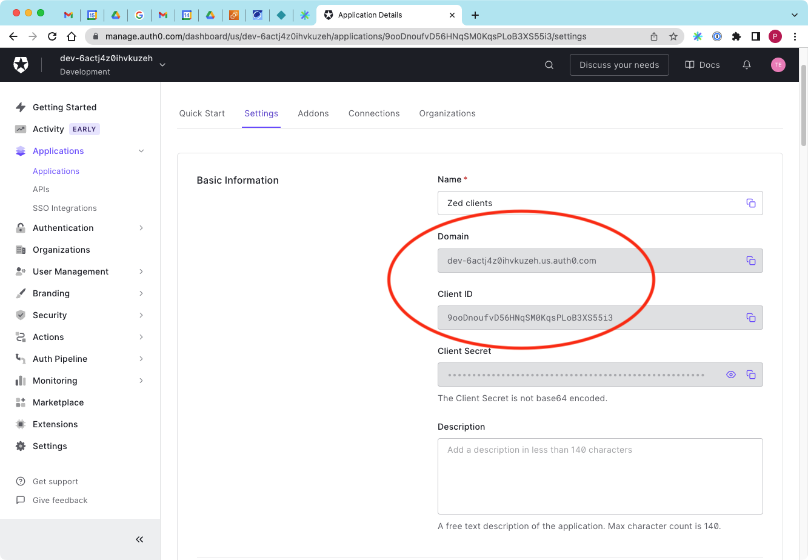

5. If you wish to allow authentication from the Zui desktop application,
scroll down in the **Settings** tab to the **Allowed Callback URLs** and
enter the value `zui://auth/auth0/callback`.

   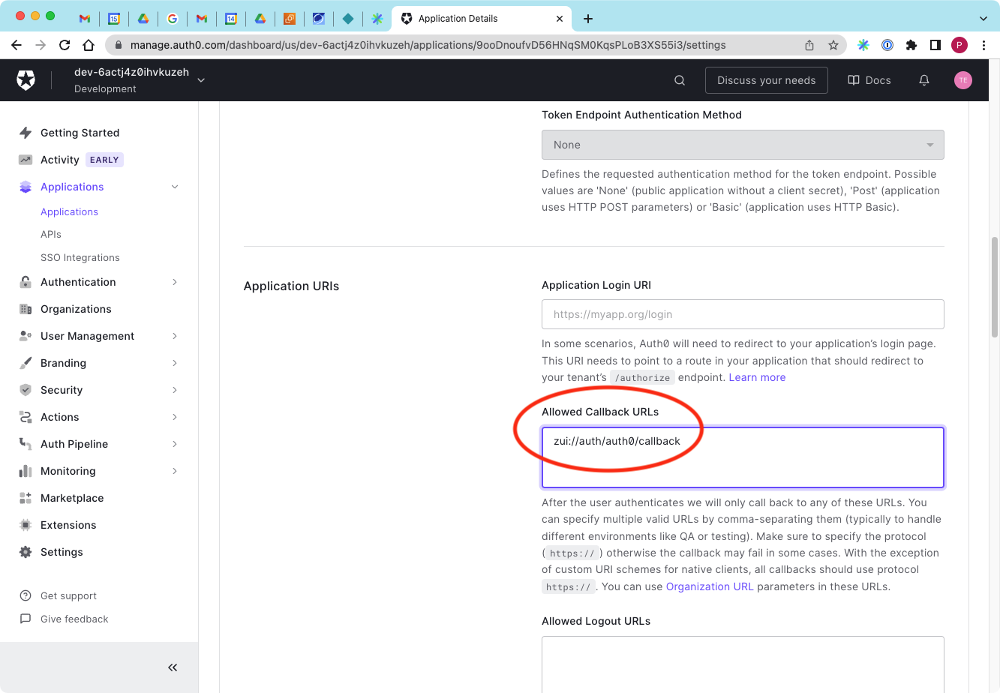

6. If you wish to allow authentication from the Zed CLI tooling and/or the
Python client, scroll down in the **Settings** tab and expand the
**Advanced Settings**, then click the **Grant Types** tab, then click the
checkbox to enable the **Device Code** grant type.

   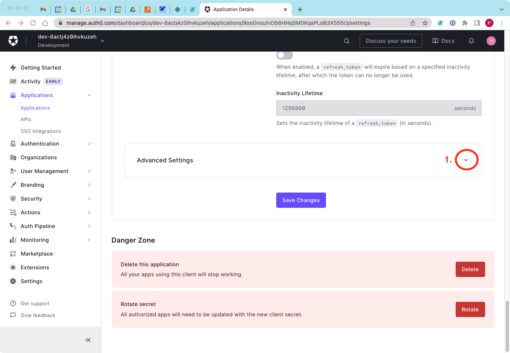

   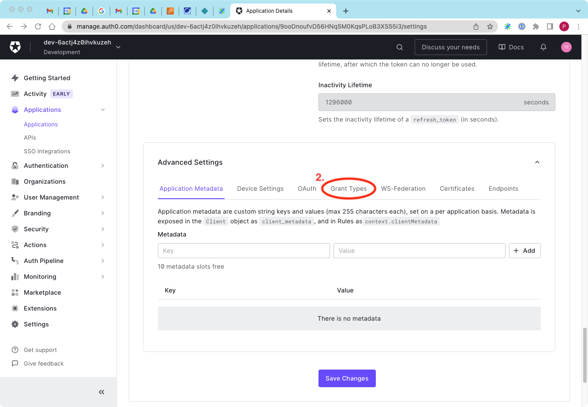

   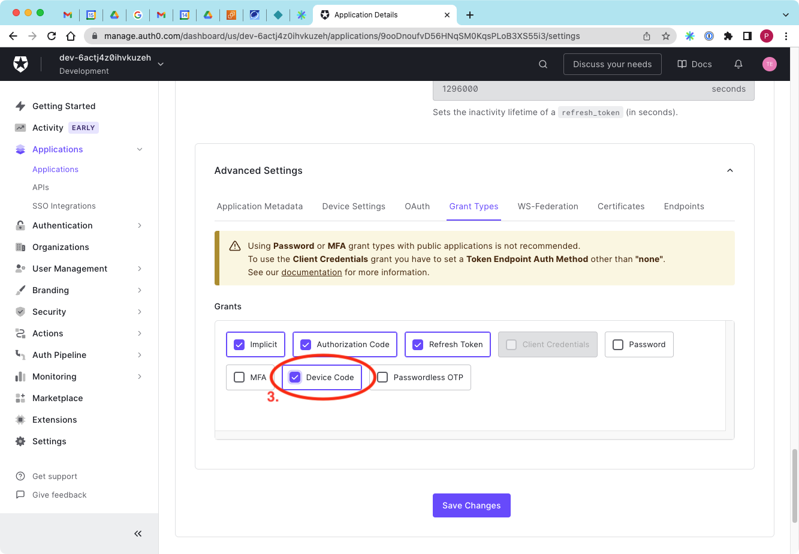

7. Scroll down to the bottom of the **Settings** tab and click the
**Save Changes** button.

   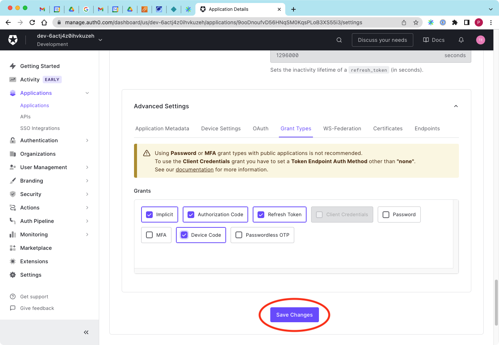

## Zed Lake Service Configuration

1. Login to our Linux VM and [install](../install.md#building-from-source)
the most recent Zed tools from source.

   ```
   $ go install github.com/brimdata/zed/cmd/zed@latest
   go: downloading github.com/brimdata/zed v1.6.0

   $ zed -version
   Version: v1.6.0
   ```

2. Set shell variables with the values you noted previously from the
Auth0 configuration for the API **Identifier** and the **Domain** and
**Client ID** values from the application configuration. Make sure the
`https://` prefix is included in the **Identifier** value.

   ```
   $ auth0_api_identifier=https://zedlakeapi.example.com
   $ auth0_clientid=9ooDnoufvD56HNqSM0KqsPLoB3XS55i3
   $ auth0_domain=https://dev-6actj4z0ihvkuzeh.us.auth0.com
   ```

3. Download the JSON Web Key Set for the domain.

   ```
   $ curl -O $auth0_domain/.well-known/jwks.json
   ```

4. Start the Zed service, specifying the required flags for the
authentication configuration along with a directory name for lake storage.

   ```
   $ zed serve \
       -auth.enabled \
       -auth.clientid=$auth0_clientid \
       -auth.domain=$auth0_domain \
       -auth.jwkspath=jwks.json \
       -auth.audience=$auth0_api_identifier \
       -lake=lake
   
   {"level":"info","ts":1678909988.9797907,"logger":"core","msg":"Started"}
   {"level":"info","ts":1678909988.9804773,"logger":"httpd","msg":"Listening","addr":"[::]:9867"}
   ...
   ```

## Authenticated Login Flow

Now that we've configured both Auth0 and the Zed lake service, we can test the
authenticated login flow with our Zed clients. The video below shows this
using [Zui v1.0.0](https://github.com/brimdata/zui/releases/tag/v1.0.0)
and the Zed CLI tooling and Zed Python client
[v1.6.0](https://github.com/brimdata/zed/releases/tag/v1.6.0).

### Summary:

1. After clicking **Add Lake** in Zui and entering a **Name** and our
**Lake URL**, the Zed lake service redirects the user to Auth0 to complete
authentication. Once authentication succeeds, Auth0 redirects back to Zui and
the user can begin operating with the lake. The user can log out by clicking
the lake URL in the left navigation menu, then clicking **Get info**, then
clicking **Logout**.

2. Before starting the authentication flow with the Zed CLI tooling, ensure the
`ZED_LAKE` environment variable is pointing at the appropriate lake URL. Once
`zed auth login` is executed, the Zed lake service redirects the user to
Auth0 where a device code is displayed that can be compared against the one
shown by the Zed CLI. Once the user clicks the **Confirm** button, the
user has authenticated and can begin operating with the lake. The credentials
are cached in `$HOME/.zed`. The user can log out via `zed auth logout`.

3. As the Python client depends on the same authentication used by the Zed CLI
tooling, you can begin authenticated operations in the Python client once
completing the previous step.

### Video:

[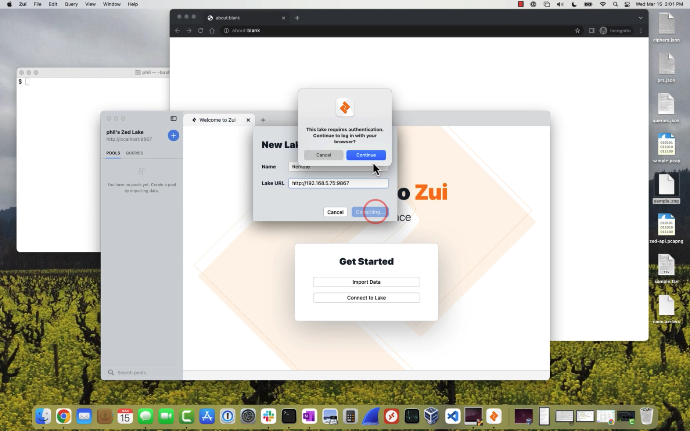](https://www.youtube.com/watch?v=iXK_9gd6obQ)
