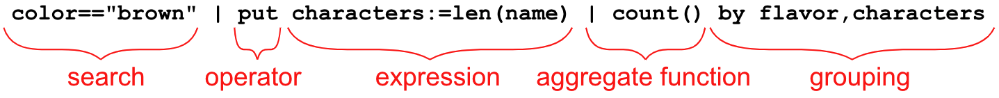
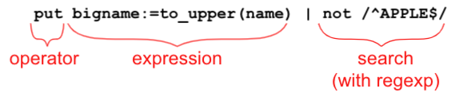

# Zed Language

The Zed system includes a powerful language for searching, analyzing, and
shaping data. The language embraces a _pipeline_ syntax that should be familiar
to those who have worked with UNIX/Linux shells. Here's a simple example query:

As is typical with pipelines, you can imagine the data flowing left-to-right
through this chain of processing elements, such that the output of each element
is the input to the next. The example above follows a common pattern seen in
other query languages where the pipeline begins with a search and further
processing is then performed on the isolated data. However, one of Zed's
strengths is that searches and expressions can appear in any order in the
pipeline.

The available pipeline elements are broadly categorized into:

* _[Searches](search-syntax/README.md)_ that isolate subsets of your data,
* _[Operators](operators/README.md)_ that transform or filter records,
* _[Expressions](expressions/README.md)_ for invoking functions or performing math and string processing on values,
* _[Aggregate Functions](aggregate-functions/README.md)_ that carry out running computations based on the values of fields in successive events, and,
* _[Grouping](grouping/README.md)_ techniques to partition data based on field values.

To build effective queries, it is also important to become familiar with the
Zed _[Data Types](data-types/README.md)_.

Each of the sections hyperlinked above describes these elements of the language
in more detail. To make effective use of the materials, it is recommended to
first review the [Documentation Conventions](conventions/README.md). You will
likely also want to download a copy of the 
[Sample Data](https://github.com/brimdata/zed-sample-data) so you can reproduce
the examples shown.
