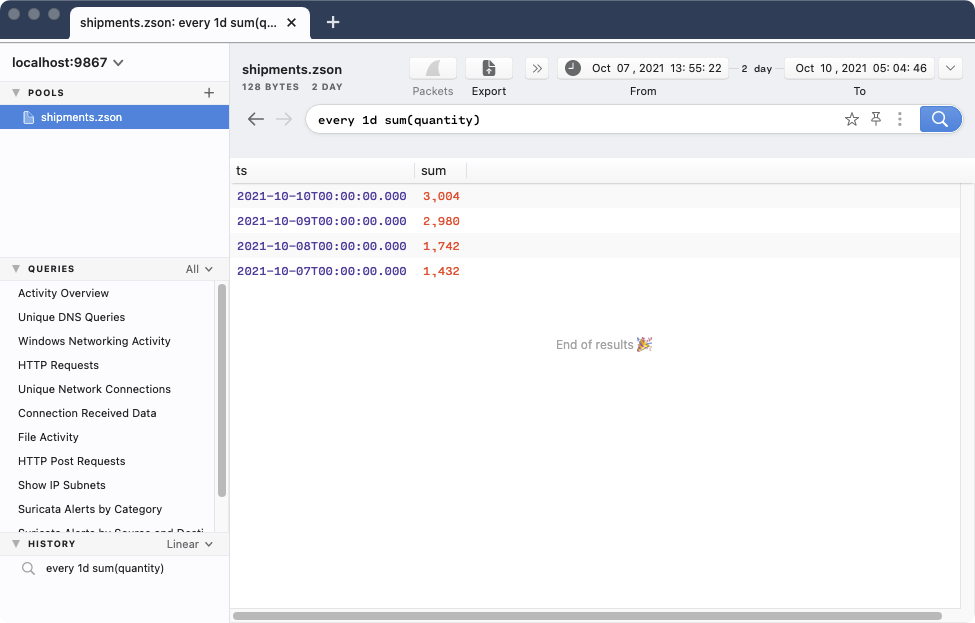

# Grouping

Zed includes _grouping_ options that partition the input stream into batches
that are aggregated separately based on field values. Grouping is most often
used with [aggregate functions](aggregate-functions.md). If explicit
grouping is not used, an aggregate function will operate over all records in the
input stream.

Below you will find details regarding the available grouping mechanisms and
tips for their effective use.

- [Time Grouping - `every`](#time-grouping---every)
- [Value Grouping - `by`](#value-grouping---by)
- [Note: Undefined Order](#note-undefined-order)

# Time Grouping - `every`

To create batches of records that are close together in time, specify
`every <duration>` before invoking your aggregate function(s).

The `<duration>` may be expressed as a combination of one or more of the
following units of time. An integer or decimal value must precede the
specification of each unit.

| **Unit**    | **Suffix** |
|-------------|------------|
| nanosecond  | `ns`       |
| microsecond | `us`       |
| millisecond | `ms`       |
| second      | `s`        |
| minute      | `m`        |
| hour        | `h`        |
| day         | `d`        |
| week        | `w`        |
| year        | `y`        |

> **Note:**: The year (`y`) duration assumes a year is always precisely 365
> days. It does not account for leap years or leap seconds.

#### Example #1:

To see the total number of bytes originated across all connections during each
minute:

```mdtest-command dir=zed-sample-data/zeek-default
zq -f table 'every 1m sum(orig_bytes) | sort -r ts' conn.log.gz
```

#### Output:
```mdtest-output head
ts                   sum
2018-03-24T17:36:00Z 1443272
2018-03-24T17:35:00Z 3851308
2018-03-24T17:34:00Z 4704644
2018-03-24T17:33:00Z 10189155
...
```

#### Example #2:

To see which 30-second intervals contained the most records, expressing the
duration as a half-minute:

```mdtest-command dir=zed-sample-data/zeek-default
zq -f table 'every 0.5m count() | sort -r count' *.log.gz
```

#### Output:
```mdtest-output head
ts                   count
2018-03-24T17:19:00Z 73512
2018-03-24T17:16:30Z 59701
2018-03-24T17:20:00Z 51229
...
```

#### Example #3:

To see the highest-numbered responding network port during each 90-second
interval, expressing the duration as a mix of minutes and seconds:

```mdtest-command dir=zed-sample-data/zeek-default
zq -f table 'every 1m30s max(id.resp_p) | sort -r ts' conn.log.gz
```

#### Output:
```mdtest-output head
ts                   max
2018-03-24T17:36:00Z 60008
2018-03-24T17:34:30Z 60008
2018-03-24T17:33:00Z 65389
...
```

# Value Grouping - `by`

To create batches of records based on the values of fields or the results of
[expressions](expressions.md), specify
`by <field-name | name:=expression> [, <field-name | name:=expression> ...]`
after invoking your aggregate function(s).

#### Example #1:

The simplest example summarizes the unique values of the named field(s), which
requires no aggregate function. To see which protocols were observed in our
Zeek `conn` records:

```mdtest-command dir=zed-sample-data/zeek-default
zq -f table 'by proto | sort' conn.log.gz
```

#### Output:
```mdtest-output
proto
icmp
tcp
udp
```

If you work a lot at the UNIX/Linux shell, you might have sought to accomplish
the same via a familiar, verbose idiom. This works in Zed, but the `by`
shorthand is preferable.

```mdtest-command dir=zed-sample-data/zeek-default
zq -f table 'cut proto | sort | uniq' conn.log.gz
```

#### Output:
```mdtest-output
proto
icmp
tcp
udp
```

#### Example #2:

By specifying multiple comma-separated field names, one batch is formed for each
unique combination of values found in those fields. To see which responding
IP+port combinations generated the most traffic:

```mdtest-command dir=zed-sample-data/zeek-default
zq -f table 'sum(resp_bytes) by id.resp_h,id.resp_p  | sort -r sum' conn.log.gz
```

#### Output:
```mdtest-output head
id.resp_h       id.resp_p sum
52.216.132.61   443       1781778597
10.47.3.200     80        1544111786
91.189.91.23    80        745226873
198.255.68.110  80        548238226
...
```

#### Example #3:

Instead of a simple field name, any of the comma-separated `by` groupings could
be based on the result of an [expression](expressions.md). The
expression must be preceded by the name that will hold the expression result
for further processing/presentation downstream in your Zed pipeline.

In our sample data, the `answers` field of Zeek `dns` records is an array
that may hold multiple responses returned for a DNS query. To see which
responding DNS servers generated the longest answers, we can group by
both `id.resp_h` and an expression that evaluates the length of `answers`
arrays.

```mdtest-command dir=zed-sample-data/zeek-default
zq -f table 'len(answers) > 0 | count() by id.resp_h,num_answers:=len(answers) | sort -r num_answers,count' dns.log.gz
```

#### Output:
```mdtest-output head
id.resp_h       num_answers count
10.0.0.100      16          4
216.239.34.10   16          2
209.112.113.33  15          2
216.239.34.10   14          4
...
```

#### Example #4

All fields referenced in a `by` grouping must be present in a given record for
the grouping to have effect.

Let's say we've performed separate aggregations for fields present in different
Zeek records. First we count the unique `host` values in `http` records.

```mdtest-command dir=zed-sample-data/zeek-default
zq -f table 'count() by host | sort -r | head 3' http.log.gz
```

#### Output:
```mdtest-output
host       count
10.47.7.58 24693
10.47.2.58 16499
10.47.6.58 15180
```

Next we count the unique `query` values in `dns` records.

```mdtest-command dir=zed-sample-data/zeek-default
zq -f table 'count() by query | sort -r | head 3' dns.log.gz
```

#### Output:
```mdtest-output
query                                                     count
ise.wrccdc.org                                            22160
*\x00\x00\x00\x00\x00\x00\x00\x00\x00\x00\x00\x00\x00\x00 3834
videosearch.ubuntu.com                                    1088
```

The following attempt to reference both fields simultaneously in a `by`
grouping to perform a single aggregation would yield no output.

```
zq -f table 'count() by host,query | sort -r' http.log.gz dns.log.gz
```

This is due to the `query` field not being present in any of the `http` records
and the `host` field not being present in any of the `dns` records. This can
be observed by looking at the [ZSON](../formats/zson.md)
representation of the type definitions for each record type.

```mdtest-command dir=zed-sample-data/zeek-default
zq -f zson 'count() by _path,typeof(.) | sort _path' http.log.gz dns.log.gz
```

#### Output:
```mdtest-output
{
    _path: "dns",
    typeof: ({_path:string,ts:time,uid:bstring,id:{orig_h:ip,orig_p:port=(uint16),resp_h:ip,resp_p:port},proto:zenum=(string),trans_id:uint64,rtt:duration,query:bstring,qclass:uint64,qclass_name:bstring,qtype:uint64,qtype_name:bstring,rcode:uint64,rcode_name:bstring,AA:bool,TC:bool,RD:bool,RA:bool,Z:uint64,answers:[bstring],TTLs:[duration],rejected:bool}),
    count: 53615 (uint64)
}
{
    _path: "http",
    typeof: ({_path:string,ts:time,uid:bstring,id:{orig_h:ip,orig_p:port=(uint16),resp_h:ip,resp_p:port},trans_depth:uint64,method:bstring,host:bstring,uri:bstring,referrer:bstring,version:bstring,user_agent:bstring,origin:bstring,request_body_len:uint64,response_body_len:uint64,status_code:uint64,status_msg:bstring,info_code:uint64,info_msg:bstring,tags:|[zenum=(string)]|,username:bstring,password:bstring,proxied:|[bstring]|,orig_fuids:[bstring],orig_filenames:[bstring],orig_mime_types:[bstring],resp_fuids:[bstring],resp_filenames:[bstring],resp_mime_types:[bstring]}),
    count: 144034 (uint64)
}
```

A way to achieve this would be to use the
[`fuse` operator](operators.md#fuse) to unite the `http` and `dns`
records under a single schema. This has the effect of populating missing
fields with null values. Now that the named fields are present in
all records, the `by` grouping has the desired effect.

```mdtest-command dir=zed-sample-data/zeek-default
zq -f table 'fuse | count() by host,query | sort -r | head 3' http.log.gz dns.log.gz
```

#### Output:
```mdtest-output
host       query          count
10.47.7.58 -              24693
-          ise.wrccdc.org 22160
10.47.2.58 -              16499
```

# Note: Undefined Order

The order of results from a grouped aggregation are undefined. If you want to
ensure a specific order, a [`sort` operator](operators.md#sort)
should be used downstream of the aggregate function(s) in the Zed pipeline.

#### Example:

If we were counting records into 5-minute batches and wanted to see these
results ordered by incrementing timestamp of each batch:

```mdtest-command dir=zed-sample-data/zeek-default
zq -f table 'every 5m count() | sort ts' *.log.gz
```

#### Output:
```mdtest-output
ts                   count
2018-03-24T17:15:00Z 441229
2018-03-24T17:20:00Z 337264
2018-03-24T17:25:00Z 310546
2018-03-24T17:30:00Z 274284
2018-03-24T17:35:00Z 98755
```

If we'd wanted to see them ordered from lowest to highest record count:

```mdtest-command dir=zed-sample-data/zeek-default
zq -f table 'every 5m count() | sort count' *.log.gz
```

#### Output:
```mdtest-output
ts                   count
2018-03-24T17:35:00Z 98755
2018-03-24T17:30:00Z 274284
2018-03-24T17:25:00Z 310546
2018-03-24T17:20:00Z 337264
2018-03-24T17:15:00Z 441229
```

Records that are stored and retrieved via
[`zed lake serve`](../../cmd/zed/lake) (that is, using the
[Brim application](https://github.com/brimdata/brim) and/or
[`zapi`](../../cmd/zapi)) are by default automatically sorted in reverse
order by timestamp (`ts`). Therefore for the particular case of a [time
grouping](#time-grouping---every) query entered via Brim or `zapi`, if the same
reverse time ordering is desired in the output of the aggregation result, an
explicit `| sort -r ts` is _not_ necessary on your Zed pipeline.

#### Output:


