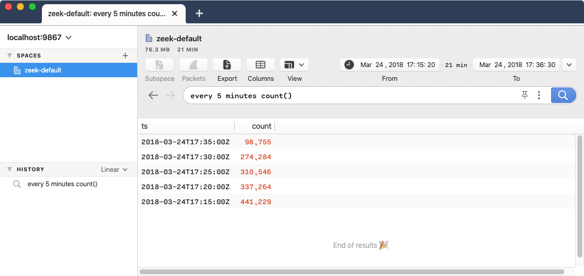

# Grouping

Zed includes _grouping_ options that partition the input stream into batches
that are aggregated separately based on field values. Grouping is most often
used with [aggregate functions](../aggregate-functions/README.md). If explicit
grouping is not used, an aggregate function will operate over all records in the
input stream.

Below you will find details regarding the available grouping mechanisms and
tips for their effective use.

- [Value Grouping - `by`](#value-grouping---by)
- [Time Grouping - `every`](#time-grouping---every)
- [Note: Undefined Order](#note-undefined-order)

# Value Grouping - `by`

To create batches of records based on the values of fields or the results of
[expressions](../expressions/README.md), specify
`by <field-name | name:=expression> [, <field-name | name:=expression> ...]`
after invoking your aggregate function(s).

#### Example #1:

The simplest example summarizes the unique values of the named field(s), which
requires no aggregate function. To see the different categories of status for
the schools in our example data:

```mdtest-command dir=zed-sample-data/edu/zson
zq -z 'by StatusType | sort' schools.zson
```

#### Output:
```mdtest-output
{StatusType:"Active"}
{StatusType:"Closed"}
{StatusType:"Merged"}
{StatusType:"Pending"}
```

If you work a lot at the UNIX/Linux shell, you might have sought to accomplish
the same via a familiar, verbose idiom. This works in Zed, but the `by`
shorthand is preferable.

```mdtest-command dir=zed-sample-data/edu/zson
zq -z 'cut StatusType | sort | uniq' schools.zson
```

#### Output:
```mdtest-output
{StatusType:"Active"}
{StatusType:"Closed"}
{StatusType:"Merged"}
{StatusType:"Pending"}
```

#### Example #2:

By specifying multiple comma-separated field names, one batch is formed for each
unique combination of values found in those fields. To see the average reading
test scores and school count for each county/district pairing:

```mdtest-command dir=zed-sample-data/edu/zson
zq -f table 'avg(AvgScrRead),count() by cname,dname | sort -r count' satscores.zson
```

#### Output:
```mdtest-output head
cname           dname                                              avg                count
Los Angeles     Los Angeles Unified                                416.83522727272725 202
San Diego       San Diego Unified                                  472                44
Alameda         Oakland Unified                                    414.95238095238096 27
San Francisco   San Francisco Unified                              454.36842105263156 26
...
```

#### Example #3:

Instead of a simple field name, any of the comma-separated `by` groupings could
be based on the result of an [expression](../expressions/README.md). The
expression must be preceded by the name of the that will hold the expression
result for further processing/presentation downstream in your Zed pipeline.

To see a count of how many school names of a particular character length
appear in our example data:

```mdtest-command dir=zed-sample-data/edu/zson
zq -f table 'count() by Name_Length:=len(School) | sort -r' schools.zson
```

#### Output:
```mdtest-output head
Name_Length count
90          1
89          2
85          1
84          3
...
```

#### Example #4

All fields referenced in a `by` grouping must be present in a given record for
the grouping to have effect.

For instance, if we'd made an typographical error in our
[prior example](#example-2) in our attempt to reference the `dname` field, no
grouped batches would be found in the data and hence no query result would
appear.

```mdtest-command dir=zed-sample-data/edu/zson
zq -f table 'avg(AvgScrRead),count() by cname,dnmae | sort -r count' satscores.zson
```

#### Output:
```mdtest-output
```

# Time Grouping - `every`

If a data source includes a field named `ts` of the `time` type, the shorthand
`every <duration>` can be used before invoking your aggregate function(s) to
create batches of records that are close together in time. If your data has
a differently-named field of the `time` type, the same can be achieved with
a grouping `by <name>:=trunc(<field-name>, <duration>)`.

The `<duration>` may be expressed as a combination of one or more of the
following units of time. An integer or decimal value must precede the
specification of each unit.

| **Unit**    | **Suffix** |
|-------------|------------|
| nanosecond  | `ns`       |
| microsecond | `us`       |
| millisecond | `ms`       |
| second      | `s`        |
| minute      | `m`        |
| hour        | `h`        |
| day         | `d`        |
| week        | `w`        |
| year        | `y`        |

> **Note:**: The year (`y`) duration assumes a year is always precisely 365
> days. It does not account for leap years or leap seconds.

#### Example #1:

Consider the following ZSON file `shipments.zson` that contains timestamped
quantities of shipped items.

```mdtest-input shipments.zson
{ts:2021-10-07T13:55:22Z,quantity:873}
{ts:2021-10-07T17:23:44Z,quantity:436}
{ts:2021-10-07T23:01:34Z,quantity:123}
{ts:2021-10-08T09:12:45Z,quantity:998}
{ts:2021-10-08T12:44:12Z,quantity:744}
{ts:2021-10-09T20:01:19Z,quantity:2003}
{ts:2021-10-09T04:16:33Z,quantity:977}
{ts:2021-10-10T05:04:46Z,quantity:3004}
```

To calculate the total quantities shipped per day:

```mdtest-command
zq -f table 'every 1d sum(quantity) | sort ts' shipments.zson
```

#### Output:
```mdtest-output
ts                   sum
2021-10-07T00:00:00Z 1432
2021-10-08T00:00:00Z 1742
2021-10-09T00:00:00Z 2980
2021-10-10T00:00:00Z 3004
```

#### Example #2:

Our school data has a `time`-typed field called `OpenDate`. To see
which collections of schools opened during each week after the start of year
2014:

```mdtest-command dir=zed-sample-data/edu/zson
zq -Z 'OpenDate >= 2014-01-01T00:00:00Z | OpenedThisWeek:=collect(School) by OpenWeek:=trunc(OpenDate, 1w) | sort OpenWeek' schools.zson
```

#### Output:
```mdtest-output head
{
    OpenWeek: 2014-01-02T00:00:00Z,
    OpenedThisWeek: [
        "Eucalyptus Hills Elementary",
        "Santa Monica-Malibu Preschool",
        "South Bay Academy Community Day"
    ]
}
{
    OpenWeek: 2014-03-20T00:00:00Z,
    OpenedThisWeek: [
        "Mitchell Child Development"
    ]
}
...
```

#### Example #3:

To revisit our [prior example](#example-1-1) and instead do our time bucketing
in increments of hours and minutes:

```mdtest-command
zq -f table 'every 6h30m sum(quantity) | sort ts' shipments.zson
```

#### Output:
```mdtest-output
ts                   sum
2021-10-07T10:00:00Z 873
2021-10-07T16:30:00Z 436
2021-10-07T23:00:00Z 123
2021-10-08T05:30:00Z 998
2021-10-08T12:00:00Z 744
2021-10-09T01:00:00Z 977
2021-10-09T14:00:00Z 2003
2021-10-10T03:00:00Z 3004
```
# Note: Undefined Order

The order of results from a grouped aggregation are undefined. If you want to
ensure a specific order, a [`sort` operator](../operators/README.md#sort)
should be used downstream of the aggregate function(s) in the Zed pipeline.
It is for this reason that our examples above all included an explicit
`| sort` at the end of each pipeline.

Records that are stored in a Zed lake are by default sorted in reverse order by
a `time` field named `ts`. Therefore for the particular case of a [time
grouping](#time-grouping---every) query entered via Brim or `zapi` on such
data, if the same reverse time ordering is desired in the output of the
aggregation result, an explicit `| sort -r ts` is _not_ necessary on your Zed
pipeline.

For example, if we'd imported the data from our [prior example](#example-1-1)
into Brim:

#### Output:


